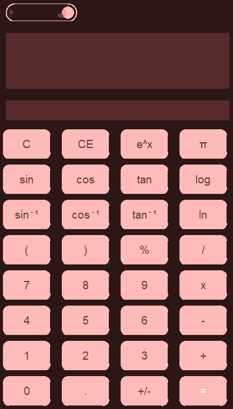

# Pink Calculator

## Overview
The Pink Calculator is a custom-built calculator application developed using Python's Tkinter library. It combines an attractive, modern interface with powerful functionality to handle both basic and advanced mathematical operations. The calculator supports light and dark modes, providing a flexible user experience. 

## Features

### Light and Dark Modes
The Pink Calculator features an intuitive toggle switch to switch between light and dark modes:

The dark mode toggle switch features a rounded design with a small circle that moves left and right to indicate the active mode. This visual cue helps users easily switch between themes while maintaining a consistent interface.

### Advanced Calculations
The Pink Calculator supports a wide range of advanced mathematical functions, including:

- **Trigonometric Functions:** `sin`, `cos`, `tan`, and their inverses (`sin⁻¹`, `cos⁻¹`, `tan⁻¹`)
- **Logarithmic Functions:** Natural logarithm (`ln`) and base-10 logarithm (`log`)
- **Exponential Functions:** `e^x`
- **Special Constants:** Pi (`π`)

These functions are implemented using Python's built-in `eval` function, which allows for dynamic evaluation of mathematical expressions entered by the user. To ensure accuracy and avoid errors, the calculator handles exceptions gracefully and provides user-friendly error messages when invalid input is encountered.

### History Tracking
The calculator maintains a history of calculations, which is displayed in a separate list box. This feature allows users to review previous computations and results, enhancing usability and providing a record of work.

## Requirements
- Python 3.x
- Tkinter (usually included with Python installations)

## Photo
### Light and Dark Modes

  
  

