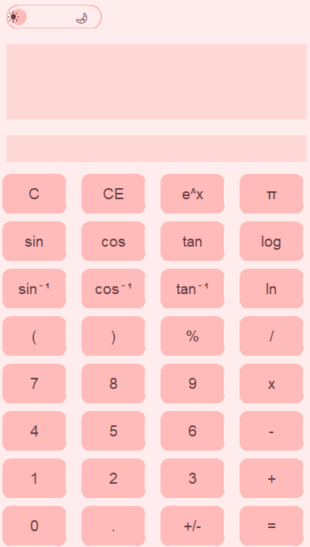

# Pink Calculator

## Overview

Pink Calculator is a feature-rich, graphical calculator built using Python's Tkinter library and SymPy. It provides an elegant and user-friendly interface for performing various mathematical operations, including trigonometric functions, logarithms, and calculus operations. The calculator also features a history display to keep track of recent calculations.

## Features

- **Advanced Mathematical Functions**: Supports operations like trigonometric functions, logarithms, exponential functions, integrals, and derivatives.
- **Custom Button Design**: Buttons are designed with rounded corners for a modern look.
- **History Tracking**: Keeps a history of calculations for easy reference.
- **Responsive Layout**: The interface adjusts dynamically to different screen sizes.

## Requirements

- Python 3.x
- Tkinter (usually included with Python)
- SymPy library

## Photo

